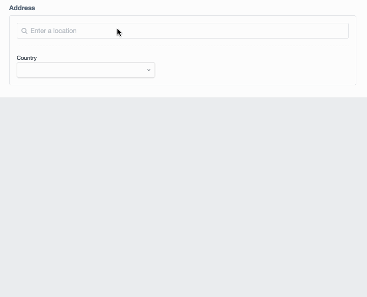
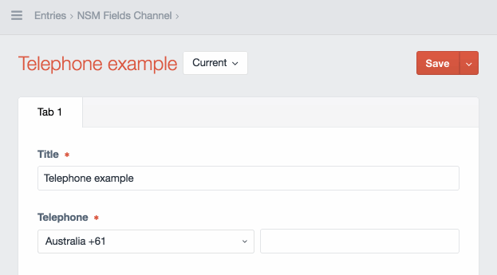
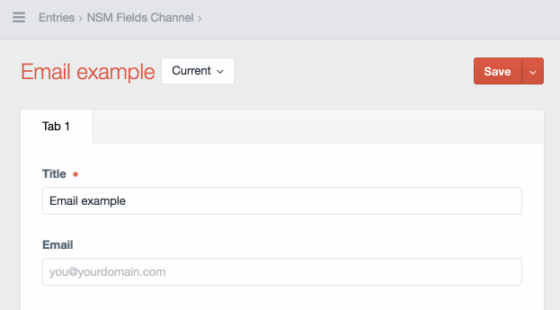
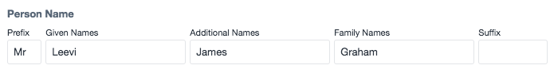
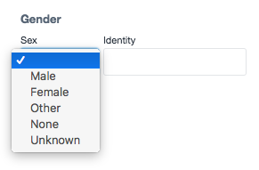

**Attention**: This plugin is under active development and will change. This is a preview release.

# Address, telephone and email fields for CraftCMS 3.x

## Address

Address field powered by Google's dataset ([commerceguys/addressing](https://github.com/commerceguys/addressing)).

Features:

* Auto-complete powered by Google Place API
* Address form formatting based on country powered by [commerceguys/addressing](https://github.com/commerceguys/addressing)
* Validation / Geo-coding on submission (TODO)

Template Tags:

The [`normalizeValue`](./src/fields/Address.php#L504) method always returns an [`AddressModel`](./src/models/AddressModel.php). All public properties are available:

Given `entry.address` is your field…

```
{{ entry.address.countryCode }}
{{ entry.address.administrativeArea }}
{{ entry.address.locality }}
{{ entry.address.dependentLocality }}
{{ entry.address.postalCode }}
{{ entry.address.sortingCode }}
{{ entry.address.addressLine1 }}
{{ entry.address.addressLine2 }}
{{ entry.address.organization }}
{{ entry.address.recipient }}
{{ entry.address.locale }}
{{ entry.address.placeData }}
{{ entry.address.latitude }}
{{ entry.address.longitude }}
{{ entry.address.mapUrl }}
```



## Telephone

Telephone field powered by [Googles phone number library](https://github.com/googlei18n/libphonenumber) implemented via [giggsey/libphonenumber-for-php](https://github.com/giggsey/libphonenumber-for-php)

Features:

* Validate phone number based on country code
* Format phone number as E164, international, national or RFC3966
* Stores Telephone model and raw user input

Template Tags:

Given `entry.telephone` is your field…

`{{ entry.telephone }}` outputs the phone number in international format.

You can also choose a specific format:

```
{{ entry.telephone.format('E164') }}
{{ entry.telephone.format('international') }}
{{ entry.telephone.format('national }}
{{ entry.telephone.format('RFC3966') }}
```

The raw input from the user is also available:

```{{ entry.telephone.rawInput }}```



## Email

Features:

* Email validation using Yii validation



## Embed

Features:

* Embed social media posts / media directly from a URL
* Live preview

Template Tags:

Given `entry.embedField` is your field…

* `{{ entry.embedField.embedData }}` outputs the returned embed object.
* `{{ entry.embedField.embedData.code | raw }}` outputs the returned embed javascript code.


## Person Name

Person name field with:

* Honorific Prefix
* Given Names
* Additional Names
* Family Names
* Honorific Suffix



## Gender

Non-binary gender field with:

* Sex
* Identity



## Installation

### Step 1: Download the Bundle

Open a command console, enter your project directory and execute the
following command to download the latest stable version of this bundle:

```console
$ composer require newism/craft3-fields
```

This command requires you to have Composer installed globally, as explained
in the [installation chapter](https://getcomposer.org/doc/00-intro.md)
of the Composer documentation.

### Step 2: Install

Install plugin in the Craft Control Panel under Settings > Plugins.
 
## Configuration

The plugin comes with a config.php file that defines some sensible defaults. 

Copy `src/config.php` to `CRAFT_CONFIG_PATH` and rename the file to `nsm-fields.php`.

## Road Map

Some things to do, and ideas for potential features:

* Split out each field into it's own plugin. Keep this plugin as a single composer file which pulls all felds in
* Address validation / Geo-coding on submission
* Display address as text in field with option to "Edit" to reduce size of field in UI
* Update commerceguys/addressing when next stable version is released

### 1.0

* Release it

### 1.1

* Add "NSM Publish Hints" field

### 1.2

* ~~Add video field with yoututbe, vimeo previews~~ See Embed Field

## Credits

Brought to you by [Newism](http://newism.com.au)

[](http://newism.com.au/)
